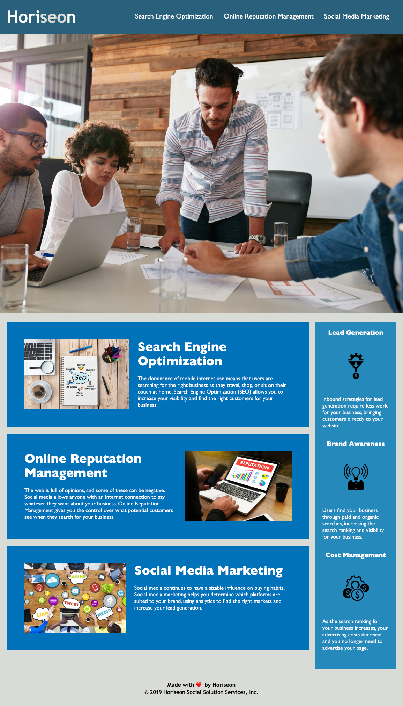

# 01-homework (Horiseon Marketing Page)

To view the actual webpage, please click [here](https://valbona1992.github.io/01-homework/).

## Summary
This assignmente requrited me to make changes to the HTML using smeantic tags and modifing the CSS styling sheet.

Below is a summary of the things I changed:

* Changed the `
` tags to other semantic tags including: `<header>`, `<footer>`, `<article>`, and `<aside>` in the appropriate sections.
* Changed the `<title>` field to a descriptive title.
* Removed redundent CSS code and renamed class attributes accordingly.
* Reorganized CSS code.
* Added comments in both CSS and HTML.
* Aligned the HTML tags for better organization.
* Added `alt` attributes to the `` tags.
* Corrected HTML links (`<a>` tags) to work properly.

## Screenshot

